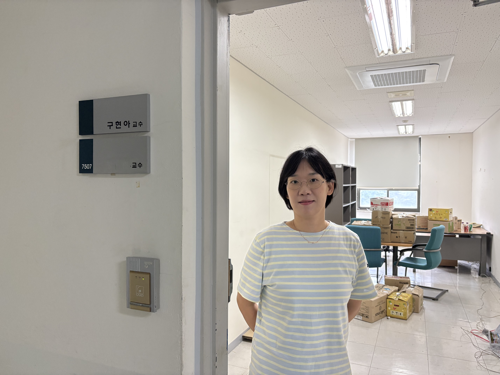
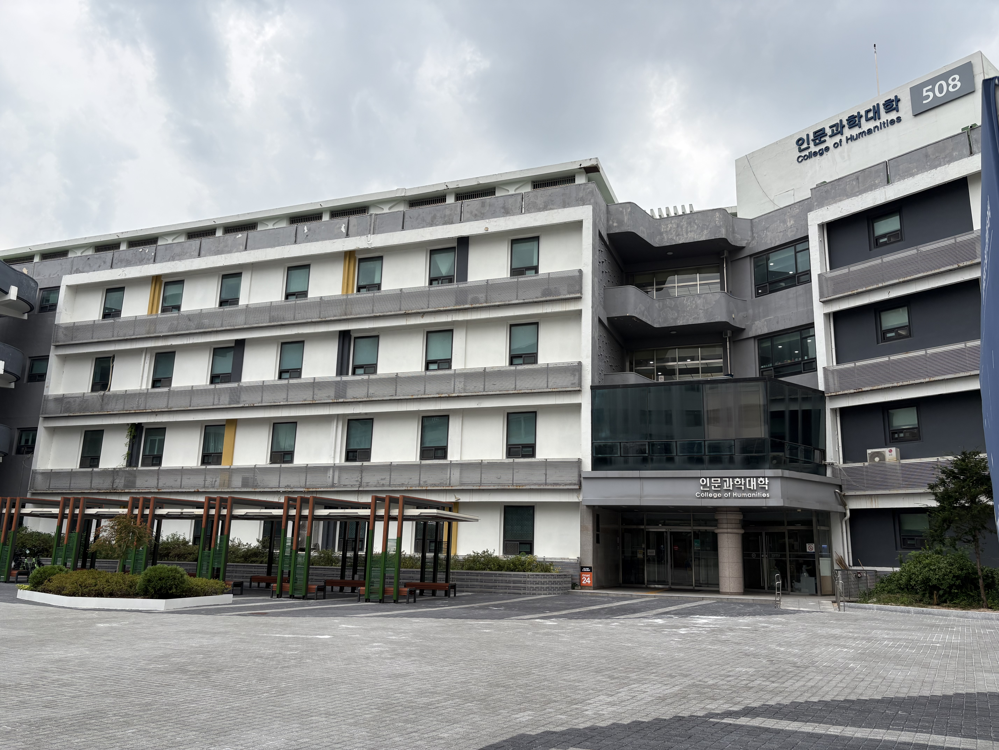
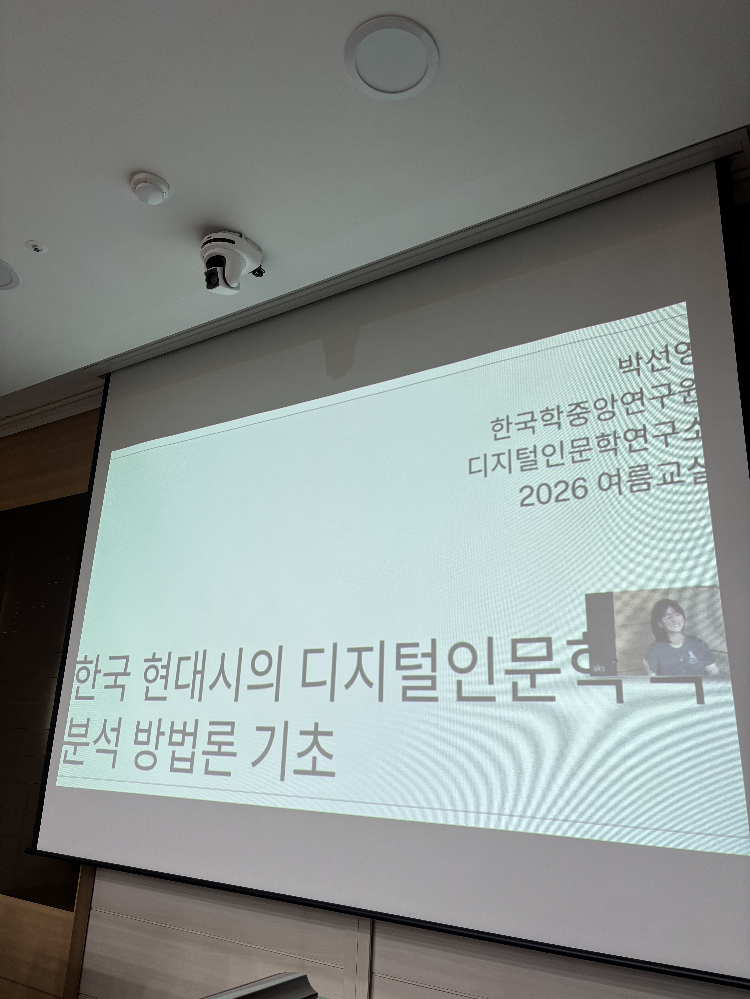

<i class="fas fa-home"></i><a href="../../"> home</a> | <i class="fas fa-sticky-note"></i><a href="../posts"> posts</a>

## 2026.8.26 한양대로 이사왔어요

2026년 8월 26일 용인대 짐을 모두 빼서, 한양대 인문관 (508) 432호로 이사왔다.
14년 가까이 있었던 학교를 이렇게 떠나니, 기분이 묘하고. 무엇보다 정든 사람들 떠나려니 아쉽다.
새로운 곳, 한양대. 인도해주신 이유가 있으리라 생각한다.
내 연구 인생의 전환점이 되길

## 2026 여름교실 워크숍에 다녀왔어요

지난주에 한국학중앙연구원에서 2026 여름교실 워크숍에 참석하였다.
열정적인 석박사생 학생들이 나와 〈한국 현대시의 디지털인문학적 분석 방법론 기초〉, 〈비정형 사료의 디지털 전환〉을 강의했다. 과정 중인 학생들이 강의하여서 학습 과정이 더 친근하게 느껴진다는 생각이 들었다.

